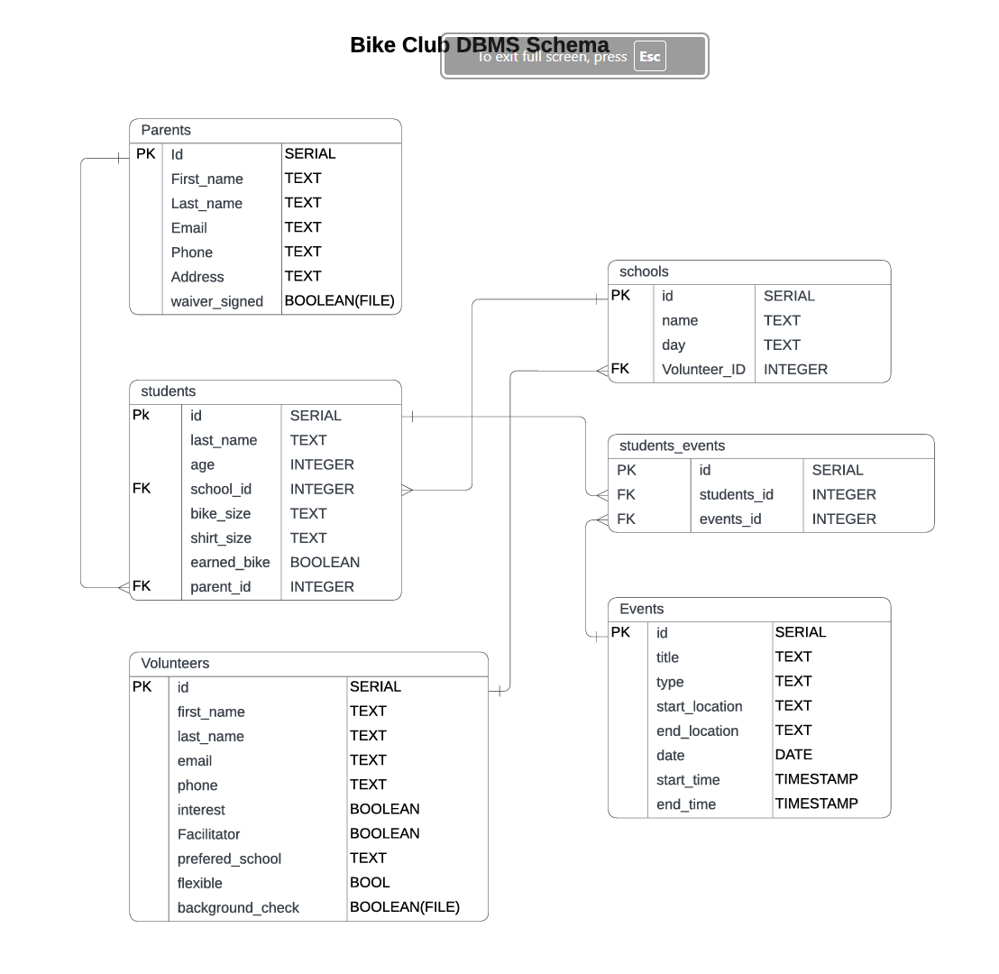
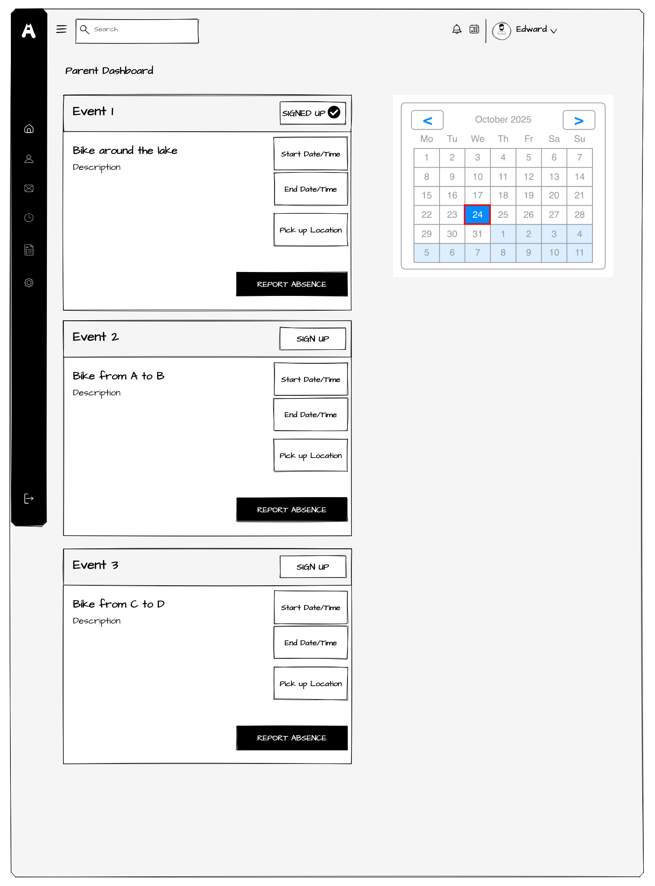
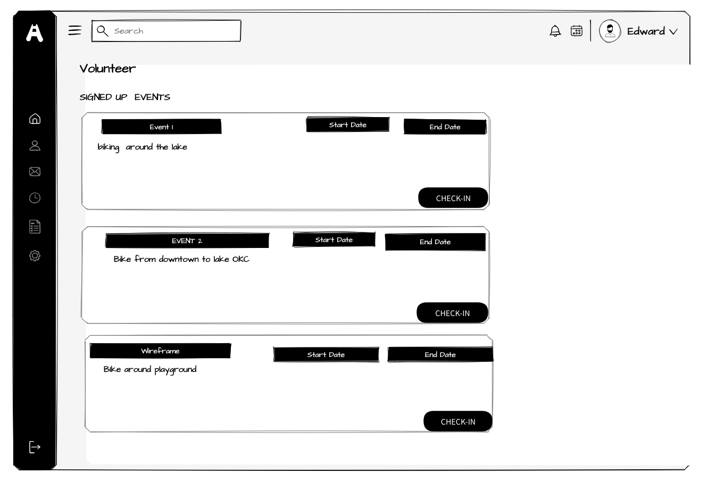
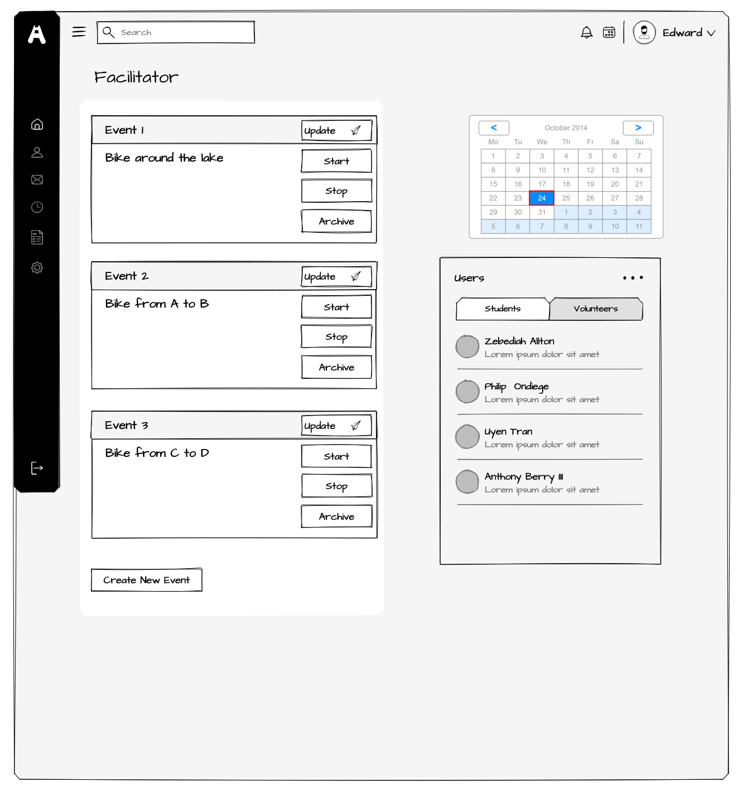

# Bike Club OKC

Frontend development for companion web app for [Bike Club OKC.](https://www.bikeclubokc.com/home)

## Team

- Uyen Tran
- Philip Ondiege
- Anthony Berry III
- Zebediah Allton

## Background

Bike Club OKC is a nonprofit organization that offers extracurricular activity to students in the Oklahoma City Public Schools district that leads groups of students on organized bicycle rides.

## Minimum Viable Product

Use there current website to add the features and functionality to better organize a method for parents of children to apply for program participation as well as for volunteers to apply to participate as well.

Create a web app that allows parents, volunteers, and facilitators to login and access a dashboard that provides information based on their user roles. This will allow facilitors to create, read, update, and delete the organized rides for different groups. Also, to better track which volunteers are assigned to which groups of student riders to better serve where the needs of volunteers will be best utilized.

Volunteer dashboards will show which assignment they will have, whether it be participating directly in a ride or serving some other needed labor like building out bicycles or picking up food and refreshments for events. The dashboard will also include a list of all the students in the orgranized ride that will have link for each student to access information to contact student's parent and other emergency contact information. They will also be able to check-in and start a ride as it begins that will potentially "track" a ride's time and route to be shared with facilitators and parents.

Parent dashboard will show schedules of organized rides and will "check-in" their child to confirm their participation in the organized ride that will be scheduled by a facilitator. Dashboard will also include information about the ride, specifically time and location of a ride's end to know when and where to pick there child up.

## Stretch Goal Features

- To create push notifications to parents and volunteers about upcoming organized rides as well as notifications about a rides end.

- To use a mapping API that shares location of volunteers within the app with facilitators and parents to track organized rides in real time.

- Add switch button to switch to Spanish translation.

## Project Management

Project will be managed and tracked through Jira. Scrum tickets will be created and assigned on project board in Jira.

## Schema

## API Endpoints

1. **/users**

- /parents/login
- /volunteers/login
- /facilitator/login

2. **/parents**

- /profile_information
- /student/:id
- /student/:id/student_info
- /calender
- /events
- /events/:id/event_info

3. **/volunteer**

- /calender
- /events
- /events/:id
- /events/:id/table_info
- /events/:id/students
- /events/:id/students/:id/profile_info

4. **/facilitator**

- /school
- /calender
- /events
- /events/:id
- /events/:id/table_info
- /events/:id/students
- /notifications/:id/users

## User Stories

### User Story 1: Parent Registration and Dashboard

- **Title: Parent can log in and register and access their dashboard**
- As a parent, I want to fill out a form that submits an application to participate in the Bike Club.
- After approval I will recieve an email to invite me to login and register my student and complete my profile information and sign a digital waiver before I can access the parent dashboard.

<ins>Dashboard Criteria</ins>

1. Scenario 1: &nbsp;&nbsp;Successful Login

- Given the parent has an existing account, when they enter valid credentials and click “Login” they are redirected to their parent dashboard.

2. Scenario 2: &nbsp;&nbsp;Invalid Login

- Given invalid credentials are entered when login is attempted, then an error message appears and access is denied.

3. Scenario 3: &nbsp;&nbsp;Week at a glance.

- Upon accessing their dashboard, they can view a listof upcoming events their student is participating in.

4. Scenario 4: &nbsp;&nbsp;Absence

- Each student in group that an event is scheduled for will be registered to participate in the event by default. If a student is unable to participate, a parent can report their absence for a student with an "Absent" button.

5. Scenario 5: &nbsp;&nbsp;Update Personal Information

- Given the parent with an existing registration, from their dashboard, a parent can update information on their profile.

---

### User Story 2: Volunteer Dashboard

- **Title: Volunteer can log in to view their assigned events**
- As a volunteer, I want to log in to the Bike Club OKC web app from the volunteer login screen. From my dashboard I can view upcoming events and checkin and manage my availability.

<ins>Dashboard Criteria</ins>

1. Scenario 1: &nbsp;&nbsp;Successful Login

- Given valid credentials, when the volunteer logs in, access is granted to the volunteer dashboard.

2. Scenario 2: &nbsp;&nbsp;Week At A Glance

- Upon accessing their dashboard, they can view a list upcoming events they have been assigned to for the week and can select a calender view to show all events for the month.

3. Scenario 3: &nbsp;&nbsp;Event Details

- When the volunteer selects an event, they will view all the information of the event that includes the title of event, type of event, date, start time, end time, location start, location end.

4. Scenario 5: &nbsp;&nbsp;Manage Commitments

- When they view “My Events,” they can view, check in or cancel participation with a "Check-In" button or a "Cancel" button.

---

### User Story 3: Facilitator Management and Oversight

- **Title: Admin can manage events, view registrations, and oversee volunteers and participants**
- As an admin I want to use the Bike Club OKC web app so that I can approve or deny the application of a student's participation as well as approve or deny the participation of volunteers. I will have access to all users information. I will also use the dashboard to create and manage events for the school I am assigned to. I can re-assign volunteers to different schools and events, I can remove other users from any specific event or all events or completely from the organization.

<ins>Dashboard Criteria</ins>

1. Scenario 1: &nbsp;&nbsp;Successful Login

- Given valid credentials, when the facilitator logs in they are redirected to the admin dashboard.

2. Scenario 2: &nbsp;&nbsp;Week At A Glance

- Upon accessing their dashboard, they can view a list of upcoming events they have been assigned to for the week and can select a calender view to show all events for the month.

- When the volunteer selects an event, they will view all the information of the event that includes the title of event, type of event, date, start time, end time, location start, location end.

3. Scenario 3: &nbsp;&nbsp;Create and Edit Events

- Given the admin selects “Create Event”, they will enter event details (title, type, name, date, start time, end time, start location, end location)
  Then the event is saved and visible to parents and volunteers.

- Given an event needs to be closed the admin selects “Stop” to stop the event.

- If an event needs to be deleted, the facilitator will be able to delete the event with a delete button on the event details screen.

4. Scenario 4: &nbsp;&nbsp;Manage Users

- From the facilitator admin dashboard, the facilitator can select the "Users" menu item to specify a screen with view of a table of either Volunteers or Students/Parents.
- Table view of volunteers will show just the name of each volunteer. Table view will allow selection of volunteers to be deactivated, activated, or deleted from.
- From the table view, the facilitator can select a specific volunteer to open a screen that displays the detailed information of the volunteer. This screen will show all information from the tables of volunteers. From the screen of a volunteer the facilitator can disable their profile to "deactivate" them from participation within the organization. If a volunteer is "deactivated" their profile will be preserved in case they become "activated" to continue their participation.
- Table view of students will show name of student, parent's name, and school. Table view will allow selection of students to be deactivated, activated, or deleted from. This table can be filtered by selecting a specific school in the school column.
- From the table view, the facilitator can select a specific student to open a screen that displays the detailed information of the student. This screen will show all information from the tables of students joined with thier parent. From the screen of a student the facilitator can disable their profile to "deactivate" them from participation within the organization. If a student is "deactivated" their profile will be preserved in a case they become "activated" to continue their participation.
- Each table view will also have a "Create" button to add a new user to the table.

## Wireframes

